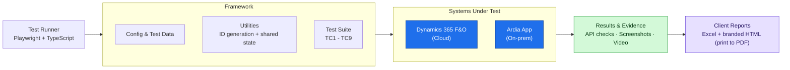

# SF Test Automation — Architecture (Simple View)

A high-level, presentation-friendly overview of the automation suite.

> Paste into [mermaid.live](https://mermaid.live) or VS Code (Mermaid preview) to render and export
> as PNG/SVG for slides.

---

## In one line per layer

- **Test Runner** — Playwright drives a real browser; tests written in TypeScript.
- **Framework** — config, test data, reusable utilities, and the 9 test cases.
- **Systems Under Test** — D365 (cloud ERP) and Ardia (on-prem production app).
- **Results & Evidence** — API status checks, per-step screenshots, and run video.
- **Client Reports** — every run produces an Excel workbook and a branded, self-contained HTML report (open in Chrome → Print → Save as PDF) for client hand-off.
