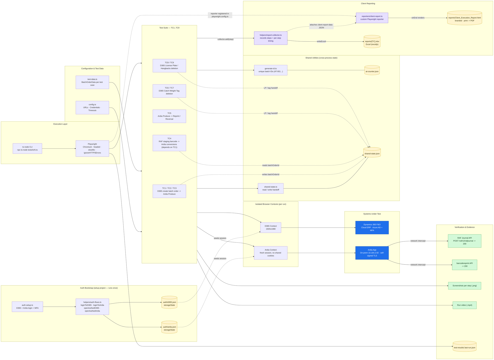

# SF Test Automation — Technical Architecture

End-to-end UI + API automation suite validating workflows across **Microsoft Dynamics 365 F&O**
(cloud ERP) and the **Ardia** shop-floor production app (on-prem). Built with Playwright + TypeScript,
run through the **Playwright Test Runner** (the `tcN.ts` logic files also run standalone via `ts-node`).
Authentication is centralized: a one-time `setup` project logs into both systems and saves
`storageState`, which every test reuses — no per-test login.

---

## Architecture Diagram (Mermaid)

> Paste into [mermaid.live](https://mermaid.live), VS Code (Mermaid preview), or hand to the
> Figma `generate_diagram` tool once the Figma integration is connected.

---

## Layer Reference

| Layer | Components | Responsibility |
|-------|-----------|----------------|
| **Execution** | `ts-node`, Playwright Chromium | Drives headed browser runs, TLS bypass for on-prem Ardia |
| **Configuration & Data** | `config.ts`, `test-data.ts` | Single source of truth for URLs/creds/timeouts and per-TC batch-order data |
| **Utilities** | `generate-id.ts`, `shared-state.ts` | Unique ID generation (`at-counter.json`) and cross-process data handoff (`shared-state.json`) |
| **Auth Bootstrap** | `tests/auth.setup.ts`, `tests/helpers/auth-flows.ts` | One-time interactive login + MFA per app; persists `storageState` to `.auth/d365.json` and `.auth/ardia.json`; reused by every test (auto re-login fallback if stale) |
| **Test Suite** | `tests/tc01..tc13.spec.ts` → `tests/tcN.ts` | E2E scenarios across D365 and Ardia (thin spec wrappers over `run(browser)` logic) |
| **Isolation** | Separate D365 / Ardia browser contexts | Prevents session bleed; each context is seeded from its own saved `storageState` |
| **Verification** | API interception + UI assertions + screenshots/video | RAF & barcodereprint status assertions, step-level visual evidence |
| **Client Reporting** | `tests/helpers/report-collector.ts`, `tests/reporters/client-report.ts` | `ReportCollector` records each step with timing → writes an Excel workbook (`exceljs`) and attaches a JSON blob; the custom reporter (registered in `playwright.config.ts`) renders one self-contained, branded `Client_Execution_Report.html` (print → PDF) |

## Key Engineering Patterns

- **Separation of concerns** — environment config, secrets (`.env`), test data, auth, and test logic are fully decoupled.
- **Authenticate once** — a `setup` project logs into D365 + Ardia and saves `storageState`; the
  `e2e` project depends on it, so tests reuse the sessions instead of logging in repeatedly.
- **Cross-process state machine** — dependent tests (TC1→TC4, TC2→TC8, TC3→TC9) hand off
  `batchOrderId` / license-plate IDs via a JSON state file, enabling ordered E2E chains.
- **Context isolation** — D365 and Ardia run in independent Playwright contexts within one browser.
- **API-level verification** — UI actions are confirmed at the network layer (`waitForResponse`
  on `POST /raf/v2/rafjournal` and `barcodereprint`), not just by visual state.
- **Deterministic identifiers** — incrementing `AT-NNN` IDs guarantee no collisions across runs.
- **Evidence-first** — every step captures a screenshot; full run recorded to video for traceability.
- **Single source of report truth** — `ReportCollector` holds the step list once, then drives both
  the Excel workbook and the client-facing HTML report, so the two never drift. The HTML report is
  produced only through the Playwright runner (the reporter reads each test's `client-report-data`
  attachment); standalone `ts-node` runs still emit the Excel file.
